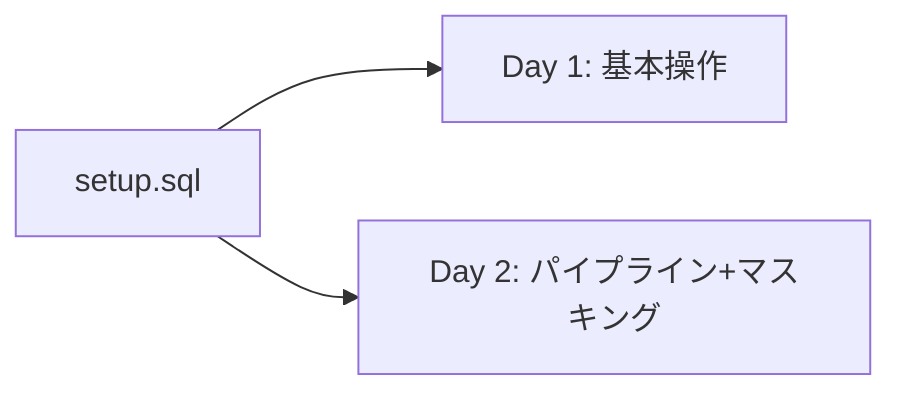

# Plan: マスキングハンズオン ノートブック作成

## 概要

既存の `tb_101` (TastyBytes) データセットをそのまま使用し、1時間x2回のハンズオン用ノートブックを作成する。

- **setup.sql**: 最小限（既存setup.sqlから不要部分を削除した簡潔版）
- **Day 1**: Snowflake基本操作 (vignette-1ベース)
- **Day 2**: データパイプライン + マスキング (vignette-2 + vignette-4 §1-3)

---

## ファイル構成

```
/Users/hirokiwatari/repo/zero_to_handson/
  handson/
    setup.sql           -- 最小限のセットアップ
    day1_basics.ipynb   -- Day 1: 基本操作
    day2_pipeline_masking.ipynb  -- Day 2: パイプライン + マスキング
```

---

## 1. setup.sql (最小限)

既存 [scripts/setup.sql](scripts/setup.sql) から以下を残す:

- DB `tb_101` 作成
- スキーマ作成: `raw_pos`, `raw_customer`, `harmonized`, `analytics`, `governance`
- WH作成: `tb_de_wh`, `tb_dev_wh`
- ロール作成: `tb_admin`, `tb_data_engineer`, `tb_dev`
- 権限付与（ロール階層、DB/スキーマ/WH権限）
- テーブル作成 + S3からのCOPY INTO（全テーブル）
- `truck_details` テーブル（truck_buildカラム + データ破損仕込み）
- `orders_v` ビュー（harmonized）
- ファイルフォーマット `csv_ff`、ステージ `s3load`

**削除するもの**:
- `semantic_layer` スキーマ関連（不要）
- `tb_cortex_wh`, `tb_analyst_wh`（不要）
- `truck_reviews` 関連（Day 1/2で使わない）
- `raw_support` スキーマ（不要）

想定行数: 約300行（現行626行 → 約半分に圧縮）

---

## 2. Day 1 ノートブック: `day1_basics.ipynb`

### 構成 (合計約35セル)

```
[Markdown] タイトル + 概要テーブル
[SQL] コンテキスト設定: USE DATABASE tb_101; USE ROLE accountadmin;

--- Section 1: 仮想ウェアハウス (0:05-0:15) ---
[Markdown] WH解説 (スケーリング、自動サスペンド/リジューム)
[SQL] SHOW WAREHOUSES;
[Markdown] WH作成パラメータ解説
[SQL] CREATE OR REPLACE WAREHOUSE my_wh ... (XSmall, AUTO_RESUME=false)
[Markdown] 起動前にクエリ → エラー体験
[SQL] USE WAREHOUSE my_wh; SELECT ... (エラー)
[Markdown] 明示的にRESUME
[SQL] ALTER WAREHOUSE my_wh RESUME;
[SQL] SELECT ... FROM analytics.orders_v (成功)
[Markdown] スケールアップ解説
[SQL] ALTER WAREHOUSE my_wh SET warehouse_size = 'Medium';
[SQL] 重いクエリ再実行

--- Section 2: クエリ結果キャッシュ (0:15-0:25) ---
[Markdown] キャッシュ解説 (24h, metadata, 自動)
[SQL] 売上集計クエリ (初回: 数秒)
[Markdown] 再実行の案内
[SQL] 同じクエリ再実行 (キャッシュヒット: ミリ秒)
[SQL] スケールダウン: ALTER WAREHOUSE my_wh SET warehouse_size = 'XSmall';

--- Section 3: データ変換: ゼロコピークローン & VARIANT (0:25-0:40) ---
[Markdown] クローン + VARIANT解説
[SQL] truck_details の中身確認 (truck_buildカラム)
[SQL] CLONE作成
[SQL] VARIANTからのデータ抽出 (コロン演算子)
[SQL] カラム追加 + UPDATE
[SQL] データ品質問題発見 (Ford vs Ford_)
[SQL] UPDATEで修正
[SQL] SWAP WITH で本番昇格
[Markdown] クリーンアップ案内
[SQL] DROP TABLE (意図的に間違ったテーブルをDROP)

--- Section 4: Time Travel / UNDROP (0:40-0:50) ---
[Markdown] Time Travel解説
[SQL] DESCRIBE TABLE → エラー確認
[SQL] UNDROP TABLE
[SQL] SELECT確認
[SQL] 正しいテーブルをDROP

--- Section 5: コスト管理 (0:50-1:00) ---
[Markdown] リソースモニター + バジェット解説
[SQL] CREATE RESOURCE MONITOR
[SQL] ALTER WAREHOUSE SET RESOURCE_MONITOR
[SQL] CREATE BUDGET (参考)
[Markdown] UI操作の案内

--- リセット ---
[Markdown] リセット手順
[SQL] DROP WAREHOUSE, RESOURCE MONITOR, BUDGET 等
```

---

## 3. Day 2 ノートブック: `day2_pipeline_masking.ipynb`

### 構成 (合計約40セル)

```
[Markdown] タイトル + 概要テーブル

--- Section 1: 外部Stageからのデータ取り込み (0:05-0:15) ---
[Markdown] Stage/COPY INTO 解説
[SQL] USE ROLE tb_data_engineer; USE WAREHOUSE tb_de_wh;
[SQL] CREATE STAGE raw_pos.menu_stage (S3 → メニューデータ)
[SQL] CREATE TABLE raw_pos.menu_staging (スキーマ定義)
[SQL] COPY INTO raw_pos.menu_staging FROM @raw_pos.menu_stage;
[SQL] SELECT確認

--- Section 2: VARIANT / FLATTEN (0:15-0:25) ---
[Markdown] 半構造化データ解説
[SQL] SELECT menu_item_health_metrics_obj (VARIANT確認)
[Markdown] コロン演算子 + キャスト解説
[SQL] コロン演算子でデータ抽出 (menu_item_id, ingredients)
[Markdown] FLATTEN解説
[SQL] LATERAL FLATTEN で材料を展開

--- Section 3: Dynamic Table (0:25-0:35) ---
[Markdown] DT解説 (宣言的、自動リフレッシュ)
[SQL] CREATE DYNAMIC TABLE harmonized.ingredient (LAG=1min)
[SQL] SELECT確認
[Markdown] 新メニュー追加のシナリオ
[SQL] INSERT INTO menu_staging (バインミー)
[Markdown] 自動リフレッシュ待ち案内
[SQL] SELECT確認 (French Baguette, Pickled Daikon)
[Markdown] DAG確認の案内 (UI操作)

--- Section 4: ロール作成 + PII自動分類 (0:35-0:45) ---
[Markdown] ガバナンスへの転換 - customer_loyaltyのPII問題提起
[SQL] USE ROLE accountadmin;
[SQL] SELECT TOP 10 FROM raw_customer.customer_loyalty; (PII確認)
[Markdown] カスタムロール + 分類解説
[SQL] CREATE ROLE tb_data_steward;
[SQL] USE ROLE securityadmin; 権限付与 (WH, DB, Schema, SELECT)
[SQL] 現在のユーザーにロール付与
[SQL] USE ROLE accountadmin; PIIタグ作成 + APPLY TAG権限
[SQL] 分類権限付与 (EXECUTE AUTO CLASSIFICATION等)
[SQL] USE ROLE tb_data_steward;
[SQL] CREATE CLASSIFICATION_PROFILE
[SQL] SET_TAG_MAP (NAME, PHONE_NUMBER, EMAIL等)
[SQL] CALL SYSTEM$CLASSIFY
[SQL] TAG_REFERENCES確認

--- Section 5: マスキングポリシー (0:45-0:55) ---
[Markdown] マスキングポリシー解説 (カラムレベルセキュリティ)
[SQL] CREATE MASKING POLICY mask_string_pii (STRING用)
[SQL] CREATE MASKING POLICY mask_date_pii (DATE用)
[SQL] ALTER TAG pii SET MASKING POLICY (タグに紐付け)
[Markdown] 効果確認の案内
[SQL] USE ROLE tb_data_steward; SELECT (マスクされる)
[SQL] USE ROLE tb_admin; SELECT (マスクされない)
[Markdown] まとめ

--- リセット ---
[Markdown] リセット手順
[SQL] マスキングポリシー解除 + DROP
[SQL] タグ解除 + DROP
[SQL] 分類プロファイル削除
[SQL] ロール削除
[SQL] Dynamic Table + menu_staging削除
[SQL] 挿入データ削除
```

---

## 設計判断

| 項目 | 判断 |
|------|------|
| setup.sql | tb_101の基本構造+データロードのみ。WH/ロールは既存構成を踏襲 |
| Day 1 データ | `truck_details` (VARIANT), `analytics.orders_v` (集計クエリ) |
| Day 2 データ | `menu` (Stage/DT), `customer_loyalty` (マスキング) |
| マスキング範囲 | カラムレベルのみ (STRING + DATE)。行アクセスポリシーは含めない |
| DT | 1つ（`harmonized.ingredient`）のみ作成。パイプライン接続は省略し時間確保 |
| リセット | 各ノートブック末尾に完全なリセットセルを配置 |

---

## ノートブック間の依存関係



Day 1 と Day 2 は**独立して実行可能**（相互依存なし）。  
どちらも `setup.sql` 実行後であれば単独で動作する。
